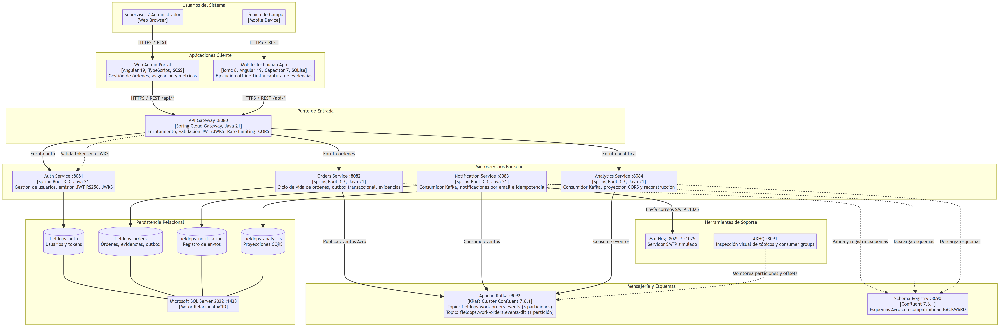
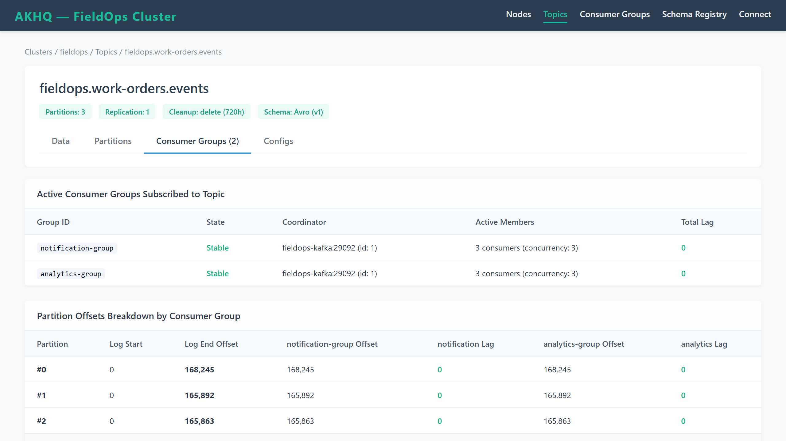

# FieldOps: Plataforma de Gestión de Órdenes de Servicio Técnico

FieldOps coordina la atención técnica en instalaciones de clientes donde las órdenes requieren asignación a especialistas, ejecución en campo y registro auditable de evidencias. El sistema centraliza la recepción de solicitudes desde la oficina central, permite el seguimiento del ciclo de vida de cada servicio y asegura la captura de fotografías y coordenadas geográficas durante la intervención.

La plataforma resuelve la falta de cobertura celular en zonas industriales o subterráneas mediante almacenamiento local transaccional y sincronización secuencial con detección de concurrencia. Asimismo, separa el procesamiento de órdenes de las notificaciones por correo y de los cálculos agregados de rendimiento, manteniendo la base de datos operativa desacoplada de los reportes analíticos de la organización.

## Arquitectura del sistema

El sistema sigue una arquitectura de microservicios orientada a eventos, con esquemas de base de datos aislados en SQL Server 2022 y un bus de streaming Apache Kafka en modo KRaft.



### Componentes principales

1. **Web Admin Portal (Angular 22):** Panel administrativo de escritorio para creación de órdenes, asignación de técnicos, consulta de métricas agregadas y seguimiento en tiempo real.
2. **Mobile Technician App (Ionic 9 + Capacitor 8):** Aplicación móvil para personal de campo con base de datos SQLite embebida, captura de fotos, geolocalización satelital y cola de sincronización FIFO.
3. **API Gateway (Spring Cloud Gateway, Java 21):** Punto de entrada perimetral con enrutamiento dinámico, validación de firmas JWT contra JWKS, CORS y limitación de tasa por ventana deslizante.
4. **Auth Service (Spring Boot 3.3.4, Java 21):** Servicio de identidades y credenciales. Gestiona usuarios, emite tokens JWT firmados asimétricamente con clave privada RSA 2048 y expone el conjunto de claves públicas en `/.well-known/jwks.json`.
5. **Orders Service (Spring Boot 3.3.4, Java 21):** Núcleo transaccional de órdenes de trabajo. Aplica la máquina de estados, valida precondiciones con bloqueo optimista (`If-Match`), persiste evidencias y almacena eventos en la tabla outbox.
6. **Notification Service (Spring Boot 3.3.4, Java 21):** Consumidor asíncrono de eventos de Kafka. Procesa avisos de asignación y cambio de estado, despachando correos HTML mediante plantillas Thymeleaf hacia un servidor SMTP con garantía de idempotencia.
7. **Analytics Service (Spring Boot 3.3.4, Java 21):** Proyector CQRS de eventos. Construye lecturas analíticas consolidadas por fecha y técnico, soportando reconstrucciones históricas de proyecciones sin consultar la base operativa.
8. **Infraestructura auxiliar:** Clúster Kafka KRaft con Schema Registry (compatibilidad BACKWARD de esquemas Avro), consola de administración de mensajería AKHQ y servidor SMTP MailHog para pruebas de correo.

---

## Puesta en marcha

### Requisitos previos
- Docker Engine 24.0 o superior
- Docker Compose v2.20 o superior
- 4 GB de memoria RAM libre para contenedores

### Arranque del entorno completo
Ejecute el script de inicio idempotente desde la raíz del repositorio:

```bash
./scripts/start.sh
```

El script genera automáticamente el par de claves RSA si no existen en `keys/`, levanta los contenedores de base de datos y mensajería, espera a que los healthchecks confirmen disponibilidad, inicializa los catálogos y esquemas relacionales, configura las particiones de Kafka y arranca los microservicios con datos de prueba.

### Puntos de acceso

| Servicio / Recurso | URL | Descripción |
|---|---|---|
| API Gateway | http://localhost:8080 | Entrada perimetral única para todas las peticiones REST |
| Rutas Auth (vía Gateway) | http://localhost:8080/api/v1/auth | Login, refresh de tokens y JWKS pública |
| Rutas Órdenes (vía Gateway) | http://localhost:8080/api/v1/work-orders | Gestión de órdenes, cambios de estado y evidencias |
| Rutas Analytics (vía Gateway) | http://localhost:8080/api/v1/analytics | Consultas de métricas y proyecciones CQRS |
| AKHQ | http://localhost:8091 | Consola web de Kafka (tópicos, particiones y offsets) |
| MailHog | http://localhost:8025 | Bandeja de entrada de correos simulados (SMTP puerto 1025) |
| Schema Registry | http://localhost:8090 | Registro de esquemas Avro (modo de compatibilidad BACKWARD) |

> **Nota de seguridad arquitectónica:** Siguiendo el principio de mínimo privilegio y defensa en profundidad, los microservicios (`auth-service`, `orders-service`, `notification-service`, `analytics-service`) se ejecutan aislados dentro de la red interna de Docker (`fieldops-net`) y no exponen puertos directamente al host. Todas las comunicaciones cliente pasan obligatoriamente por el **API Gateway** (puerto 8080), donde se aplican las validaciones de firmas JWT, límites de tasa y CORS.

### Credenciales de demostración

| Usuario | Correo | Contraseña | Rol |
|---|---|---|---|
| supervisor | supervisor@fieldops.com | Demo2026! | ROLE_SUPERVISOR |
| tecnico1 | tecnico1@fieldops.com | Demo2026! | ROLE_TECHNICIAN |
| tecnico2 | tecnico2@fieldops.com | Demo2026! | ROLE_TECHNICIAN |
| tecnico3 | tecnico3@fieldops.com | Demo2026! | ROLE_TECHNICIAN |

---

## Flujo de un evento de punta a punta

Cuando un técnico inicia o finaliza un servicio en la aplicación móvil, el evento recorre la arquitectura siguiendo el patrón Transactional Outbox:

1. **Ingreso y persistencia ACID:** La petición HTTP PATCH/POST llega a `orders-service` a través del gateway. El servicio actualiza el estado de la orden en la tabla `work_order` e inserta una fila en `outbox_event` dentro de la misma transacción de base de datos. Si la base de datos rechaza la operación, ni la orden ni el evento se confirman.
2. **Publicación asíncrona:** El componente `OutboxPublisher` lee los eventos pendientes ordenados cronológicamente por `(created_at, id)` y los despacha al topic `fieldops.work-orders.events` en Kafka, utilizando la clave de partición `orderId`. El uso de `orderId` asegura que todas las transiciones de una misma orden viajen a la misma partición física, garantizando orden cronológico estricto por orden de trabajo. Ante un error transitorio de red o broker en una orden específica, el publicador aísla el agregado afectado para evitar carreras en esa orden sin detener el progreso de las demás órdenes del lote.
3. **Validación de esquema:** Schema Registry verifica que la carga útil coincida con la versión registrada del esquema Avro `WorkOrderEvent`.
4. **Consumo distribuido:** Dos grupos de consumidores independientes procesan el mensaje en paralelo:
   - `notification-group` (`notification-service`): comprueba idempotencia deduplicando por `(eventId, consumerGroup)`, resuelve al destinatario desde el directorio o payload sin inventar correos ficticios, genera el correo con el detalle del servicio y lo entrega al servidor SMTP.
   - `analytics-group` (`analytics-service`): deduplica eventos y actualiza la proyección pre-agregada diaria (`work_order_daily_metrics`) indexada secundariamente por técnico y fecha.



Como se aprecia en la captura de AKHQ, ambos grupos operan con concurrencia alineada a las 3 particiones del topic, manteniendo un retardo (lag) de cero mensajes tras procesar eventos en pruebas de carga.

---

## Rendimiento y optimización

Durante las pruebas de carga sobre un volumen de 500.000 órdenes de trabajo y más de 1.000.000 de cambios de estado, se analizó el comportamiento de la consulta de métricas de productividad (`GET /api/v1/work-orders/metrics`). La versión preliminar ejecutaba escaneos completos de tabla debido a funciones no sargables sobre columnas de fecha y subconsultas correlacionadas.

La optimización sustituyó las expresiones funcionales por rangos semiabiertos, introdujo un índice compuesto cubriente con `INCLUDE` y un índice filtrado excluyendo órdenes canceladas. Paralelamente, se implementó la proyección pre-agregada CQRS en `analytics-service`.

| Indicador | Consulta inicial | Consulta optimizada SQL | Proyección CQRS |
|---|---|---|---|
| Operación en plan de ejecución | Clustered Index Scan | Index Seek (cubriente) | Primary Key Seek |
| Lecturas lógicas (páginas de 8 KB) | 32.450 páginas | 88 páginas | 4 páginas |
| Latencia mediana (p50) | 2.650 ms | 16,8 ms | 4,2 ms |
| Latencia percentil 99 (p99) | 3.120 ms | 28,4 ms | 7,1 ms |
| Memoria JVM consumida | ~280 MB | < 1 KB | < 1 KB |
| Factor de aceleración | 1x (referencia) | 157x | 630x |

El detalle técnico completo de los planes de ejecución y estadísticas de E/S se encuentra documentado en [docs/performance/optimizacion-consultas.md](docs/performance/optimizacion-consultas.md).

---

## Decisiones de arquitectura (ADRs)

Las decisiones estructurales tomadas durante el desarrollo del proyecto se encuentran formalizadas bajo el estándar ADR:

- [ADR 0001: Descomposición en cinco microservicios y límites de agregación](docs/adr/0001-separacion-en-servicios.md)
- [ADR 0002: Apache Kafka como bus de eventos y patrón Transactional Outbox](docs/adr/0002-kafka-como-bus-de-eventos.md)
- [ADR 0003: Autenticación con JWT RS256 y distribución mediante JWKS](docs/adr/0003-jwt-rs256-con-jwks.md)
- [ADR 0004: Sincronización sin conexión, cola de operaciones y resolución de conflictos](docs/adr/0004-sincronizacion-offline.md)
- [ADR 0005: Elección de Capacitor frente a Cordova y migración de complementos](docs/adr/0005-capacitor-sobre-cordova.md)
- [ADR 0006: Limitación de tasa reactiva en memoria con ventana deslizante](docs/adr/0006-rate-limiting-en-memoria.md)
- [ADR 0007: Estrategia de almacenamiento de credenciales en el cliente web y móvil](docs/adr/0007-almacenamiento-tokens-frontend.md)
- [ADR 0008: Numeración secuencial y prefijos de migraciones Flyway](docs/adr/0008-numeracion-migraciones.md)
- [ADR 0009: Resolución desacoplada de destinatarios para notificaciones](docs/adr/0009-resolucion-destinatarios-notificacion.md)

---

## Fuera de alcance

Las siguientes capacidades se omiten deliberadamente para acotar la complejidad operativa de la versión actual:

1. **Pasarela de pagos y facturación fiscal:** El sistema finaliza su flujo en la certificación técnica del trabajo. No incluye cálculo de impuestos locales, emisión de facturas electrónicas ni cobro con tarjeta.
2. **Videollamadas o mensajería instantánea:** La comunicación entre el despachador y el técnico utiliza canales externos. No se incorpora soporte para WebRTC ni WebSockets de mensajería interactiva.
3. **Planificación automatizada de rutas de tráfico vehicular:** La asignación de órdenes depende del criterio del supervisor. No se ejecutan algoritmos de optimización de rutas con datos de tráfico en tiempo real.
4. **Soporte multi-tenant con aislamiento físico de bases de datos:** Todos los clientes y organizaciones operan en esquemas lógicos unificados. No existe particionamiento por catálogo de base de datos para distintos clientes corporativos.
5. **Captura de firma biométrica en pantalla:** La confirmación del servicio se valida mediante evidencia fotográfica y coordenadas satelitales, sin recolección de trazos de firma digital en el dispositivo táctil.
